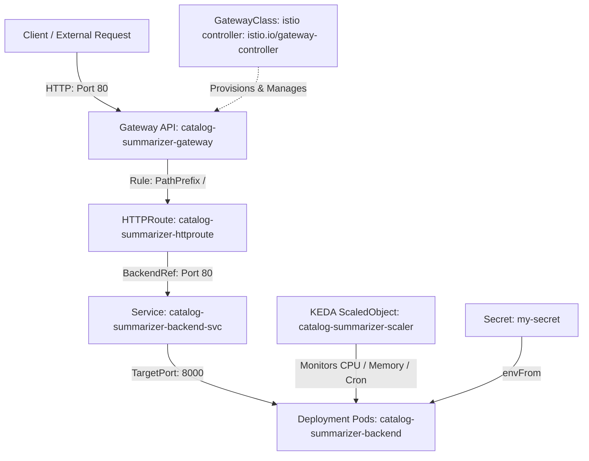

# Comprehensive Kubernetes, KEDA & Gateway API Manifest Guide

This guide provides an exhaustive technical reference for [keda-backend-simple.yaml](file:///home/selva/Documents/Production/Product-Catalog-Summarizer-for-Sellers/minikube/keda-backend-simple.yaml). It covers **high-level architecture**, **the 10-step request execution journey**, **how Gateway controllers provision infrastructure**, **block-by-block manifest analysis with full YAML code**, **custom domain (e.g., `selvakumar.in`) and HTTPS configurations**, and **operational runbooks**.

---

## Table of Contents
1. [High-Level Architecture & Data Flow](#1-high-level-architecture--data-flow)
2. [Step-by-Step Packet Request Execution Journey (Hop-by-Hop)](#2-step-by-step-packet-request-execution-journey-hop-by-hop)
3. [How Gateway Controllers Provision Infrastructure](#3-how-gateway-controllers-provision-infrastructure)
4. [Block-by-Block Manifest Reference & Detailed Analysis](#4-block-by-block-manifest-reference--detailed-analysis)
   - [Block 1: Deployment (`kind: Deployment`)](#block-1-deployment-kind-deployment)
   - [Block 2: Service (`kind: Service`)](#block-2-service-kind-service)
   - [Block 3: KEDA ScaledObject (`kind: ScaledObject`)](#block-3-keda-scaledobject-kind-scaledobject)
   - [Block 4: GatewayClass (`kind: GatewayClass`)](#block-4-gatewayclass-kind-gatewayclass)
   - [Block 5: Gateway (`kind: Gateway`)](#block-5-gateway-kind-gateway)
   - [Block 6: HTTPRoute (`kind: HTTPRoute`)](#block-6-httproute-kind-httproute)
5. [Deep Dive: HTTPRoute Match Rules, Conflicts & ResolvedRefs](#5-deep-dive-httproute-match-rules-conflicts--resolvedrefs)
6. [Configuring Custom Domains (e.g., `selvakumar.in`) & HTTPS/TLS](#6-configuring-custom-domains-eg-selvakumarin--httpstls)
7. [Operational Guide, Verification Commands & Troubleshooting](#7-operational-guide-verification-commands--troubleshooting)

---

## 1. High-Level Architecture & Data Flow

The following diagram illustrates how external requests travel through the Kubernetes Gateway API and Istio Service Mesh to application pods, as well as how KEDA and Secrets interact with the workload.



---

## 2. Step-by-Step Packet Request Execution Journey (Hop-by-Hop)

When a client makes a request (e.g., `GET http://selvakumar.in/api/v1/health`), the packet travels through 10 distinct physical and logical steps:

```
[Client] ➔ 1. DNS Resolution ➔ 2. Cloud/Edge Load Balancer ➔ 3. Gateway Envoy Proxy Pod 
         ➔ 4. Listener Match ➔ 5. Envoy Routing Table ➔ 6. Path Matching 
         ➔ 7. ClusterIP Service ➔ 8. Pod Selection ➔ 9. Istio Sidecar (mTLS) ➔ 10. FastAPI Container
```

1. **Client Sends Request**: A client (browser, curl, microservice) initiates an HTTP request to `http://selvakumar.in/api/v1/health`.
2. **DNS Resolution to Load Balancer**: DNS resolves `selvakumar.in` to a cloud load balancer IP (e.g., AWS ALB/NLB, GCP Load Balancer) or Minikube ingress IP at the cluster edge.
3. **Load Balancer Forwards to Gateway Proxy Pod**: The load balancer forwards the packet to the Gateway's ingress proxy Pods (Envoy proxy instances running inside the cluster provisioned by Istio).
4. **Gateway Listener Check**: The Envoy proxy checks its Listener configuration (`catalog-summarizer-gateway`). It verifies that port `80`, protocol `HTTP`, and hostname requirements match the incoming request.
5. **Istio Controller Configuration Loading**: The Istio Gateway controller translates attached `HTTPRoute` resources into Envoy dynamic configuration (LDS/RDS) loaded directly into the Envoy Pod's memory.
6. **Path Prefix Matching**: Envoy evaluates the path matching rules in `catalog-summarizer-httproute`. Since `PathPrefix: /` is a catch-all rule, the request path `/api/v1/health` matches this route.
7. **Forwarding to ClusterIP Service**: Envoy routes the matched request to `backendRef`: `catalog-summarizer-backend-svc` on port `80`.
8. **Service Endpoint Selection**: The Kubernetes Service (`catalog-summarizer-backend-svc`) uses its label selector `app: catalog-summarizer-backend` to pick one healthy destination Pod behind the Service.
9. **Istio Sidecar Hop (mTLS)**: If Istio sidecar injection is enabled, the request is received by the destination Pod's `istio-proxy` sidecar container via iptables/eBPF redirection, terminating mTLS encryption.
10. **Application Process Execution**: The `istio-proxy` sidecar forwards the HTTP request over `localhost` to port `8000` where the FastAPI / Uvicorn application process processes it and returns the HTTP response back along the reverse chain.

---

## 3. How Gateway Controllers Provision Infrastructure

Creating a `Gateway` YAML manifest does **not** directly create application pods. Instead, it acts as a declarative specification that a controller reconciles into real cluster infrastructure:

1. **GatewayClass Controller Trigger**: When a `Gateway` resource with `gatewayClassName: istio` is created, Istio's controller (`istio.io/gateway-controller`) detects it.
2. **Envoy Deployment Provisioning**: Istio automatically provisions a dedicated Kubernetes `Deployment` running the Envoy proxy image (e.g., Pods labeled `istio.io/gateway-name=catalog-summarizer-gateway`).
3. **Gateway Service Provisioning**: Istio creates a Kubernetes `Service` (typically type `LoadBalancer` or `NodePort`) to expose the Envoy proxy Pods to edge network traffic.

### Verifying Controller Provisioned Resources
To view the underlying infrastructure generated by Istio for your Gateway:
```bash
# View the Envoy proxy Deployment created by the Gateway API controller
kubectl get deployment -n default -l istio.io/gateway-name=catalog-summarizer-gateway

# View the running Envoy Gateway Pods
kubectl get pods -n default -l istio.io/gateway-name=catalog-summarizer-gateway

# View the edge Service created for the Gateway
kubectl get svc -n default -l istio.io/gateway-name=catalog-summarizer-gateway
```

---

## 4. Block-by-Block Manifest Reference & Detailed Analysis

---

### Block 1: Deployment (`kind: Deployment`)

#### Purpose & Detailed Description
- **Primary Purpose**: Defines and manages the desired state for the backend application container workload, ensuring that pod replicas remain active, healthy, and correctly configured.
- **Architectural Role**: The Deployment acts as the core workload controller. It specifies *what* container image to run (`catalog-summarizer-backend:latest`), *how* to run it (Uvicorn/FastAPI listening on port `8000`), *where* to retrieve sensitive environment variables (`envFrom: secretRef: my-secret`), and *how* to monitor application health via liveness and readiness probes (`/api/v1/health`).
- **Autoscaling Design Choice**: `.spec.replicas` is intentionally omitted from the Deployment manifest. This grants sole authority over pod counts to KEDA (`ScaledObject`), preventing `kubectl apply` from overriding active autoscaling decisions and causing pod thrashing.

#### Full Manifest Code
```yaml
apiVersion: apps/v1
kind: Deployment
metadata:
  name: catalog-summarizer-backend
  namespace: default
  labels:
    app: catalog-summarizer-backend
spec:
  selector:
    matchLabels:
      app: catalog-summarizer-backend
  template:
    metadata:
      labels:
        app: catalog-summarizer-backend
    spec:
      containers:
      - name: backend
        image: catalog-summarizer-backend:latest
        imagePullPolicy: IfNotPresent
        ports:
        - containerPort: 8000
          name: http
        envFrom:
        - secretRef:
            name: my-secret
        env:
        - name: TF_MODEL_NAME
          value: "gemini-2.0-flash"
        - name: TF_MODEL_TEMPERATURE
          value: "0.3"
        resources:
          requests:
            cpu: "100m"
            memory: "256Mi"
          limits:
            cpu: "500m"
            memory: "512Mi"
        livenessProbe:
          httpGet:
            path: /api/v1/health
            port: 8000
          initialDelaySeconds: 10
          periodSeconds: 15
        readinessProbe:
          httpGet:
            path: /api/v1/health
            port: 8000
          initialDelaySeconds: 5
          periodSeconds: 10
```

#### Detailed Field Breakdown

| Field | Description & Purpose |
| :--- | :--- |
| `apiVersion: apps/v1` | Standard Kubernetes API group for workload management resources. |
| `kind: Deployment` | Specifies a workload controller that manages Pod instances declaratively. |
| `metadata.name` | `catalog-summarizer-backend` — The unique resource name in the namespace. |
| `metadata.namespace` | `default` — The target namespace for deployment. |
| `spec.selector.matchLabels` | Defines how the Deployment controller finds which Pods to manage. Must match `template.metadata.labels`. |
| **`spec.replicas` (Omitted)** | **Crucial Architecture Decision:** `replicas` is intentionally omitted. When KEDA (`ScaledObject`) or an HPA manages scaling, hardcoding `replicas: 1` would cause `kubectl apply` to reset running pods to 1, overriding active autoscaling decisions and causing pod thrashing. Omitting `replicas` allows KEDA sole ownership of the replica count. |
| `containers[0].name` | `backend` — Name of the container inside the pod. |
| `containers[0].image` | `catalog-summarizer-backend:latest` — Docker image name for the FastAPI app. |
| `containers[0].imagePullPolicy` | `IfNotPresent` — Uses local cached image if available (optimal for Minikube). |
| `containers[0].ports` | Listens on `containerPort: 8000` (FastAPI/Uvicorn default port). Named `http` for Istio Envoy protocol identification. |
| `containers[0].envFrom` | Automatically injects all key-value pairs stored in Kubernetes Secret `my-secret` as environment variables. |
| `containers[0].env` | Explicit non-secret environment variables (`TF_MODEL_NAME: gemini-2.0-flash`, `TF_MODEL_TEMPERATURE: 0.3`). |
| `containers[0].resources` | **Requests:** `100m` CPU / `256Mi` Memory (guaranteed minimum). <br/> **Limits:** `500m` CPU / `512Mi` Memory (maximum allowed before throttling/OOM kill). |
| `containers[0].livenessProbe` | Periodically checks `http://:8000/api/v1/health` every 15s (after 10s delay). Automatically restarts unhealthy containers. |
| `containers[0].readinessProbe` | Checks `http://:8000/api/v1/health` every 10s (after 5s delay). Ensures container is ready to handle traffic before joining Service endpoints. |

---

### Block 2: Service (`kind: Service`)

#### Purpose & Detailed Description
- **Primary Purpose**: Provides a stable internal virtual IP (ClusterIP) and DNS entry (`catalog-summarizer-backend-svc`) to load-balance traffic across dynamic backend Pod replicas.
- **Architectural Role**: Individual Pods are ephemeral and receive new IP addresses upon restart or scaling. The Service acts as a permanent internal abstraction layer. It maps external/cluster HTTP port `80` to internal container port `8000`.
- **Istio Protocol Naming**: The port is explicitly named `name: http`. Istio's Envoy sidecar proxies inspect port names to detect protocol types; naming it `http` enables Envoy to collect HTTP Layer-7 telemetry, distributed tracing, and request metrics.

#### Full Manifest Code
```yaml
apiVersion: v1
kind: Service
metadata:
  name: catalog-summarizer-backend-svc
  namespace: default
spec:
  type: ClusterIP
  ports:
  - port: 80
    targetPort: 8000
    protocol: TCP
    name: http
  selector:
    app: catalog-summarizer-backend
```

#### Detailed Field Breakdown

| Field | Description & Purpose |
| :--- | :--- |
| `apiVersion: v1` | Core Kubernetes API group for fundamental network resources. |
| `kind: Service` | Abstracts access to a set of pods using a stable virtual IP (ClusterIP) and DNS entry. |
| `metadata.name` | `catalog-summarizer-backend-svc` — DNS entry name within the cluster. |
| `spec.type` | `ClusterIP` — Exposes the Service on a cluster-internal IP (standard microservice design). |
| `spec.ports[0].port` | `80` — Standard HTTP port exposed to internal cluster clients (`http://catalog-summarizer-backend-svc`). |
| `spec.ports[0].targetPort` | `8000` — Routes traffic from Service port `80` to container port `8000` where Uvicorn listens. |
| **`spec.ports[0].name`** | **`http` — Critical Istio Requirement:** Istio inspects port names to determine protocol. Naming the port `http` enables Istio Envoy proxies to collect L7 HTTP telemetry, distributed tracing, and routing features. |
| `spec.selector` | Maps Service traffic to all Pods with label `app: catalog-summarizer-backend`. |

---

### Block 3: KEDA ScaledObject (`kind: ScaledObject`)

#### Purpose & Detailed Description
- **Primary Purpose**: Enables event-driven and multi-trigger autoscaling for the backend Deployment workload.
- **Architectural Role**: Connects KEDA (Kubernetes Event-driven Autoscaling) to the `catalog-summarizer-backend` Deployment. Instead of static replica counts, it dynamically scales the pod count between `1` (minimum) and `3` (maximum) based on real-time metric thresholds (CPU >70%, Memory >75%) and pre-scales to 3 pods during weekday business hours (9 AM - 8 PM IST) to eliminate cold-start latency.

#### Full Manifest Code
```yaml
apiVersion: keda.sh/v1alpha1
kind: ScaledObject
metadata:
  name: catalog-summarizer-scaler
  namespace: default
spec:
  scaleTargetRef:
    apiVersion: apps/v1
    kind: Deployment
    name: catalog-summarizer-backend
  minReplicaCount: 1
  maxReplicaCount: 3
  pollingInterval: 15
  cooldownPeriod: 60
  triggers:
  - type: cpu
    metricType: Utilization
    metadata:
      value: "70"
  - type: memory
    metricType: Utilization
    metadata:
      value: "75"
  - type: cron
    metadata:
      timezone: Asia/Kolkata
      start: "0 9 * * 1-5"
      end: "0 20 * * 1-5"
      desiredReplicas: "3"
```

#### Detailed Field Breakdown

| Field | Description & Purpose |
| :--- | :--- |
| `apiVersion: keda.sh/v1alpha1` | KEDA Custom Resource Definition (CRD) API group. |
| `kind: ScaledObject` | KEDA custom resource defining autoscaling rules and triggers for a workload. |
| `spec.scaleTargetRef` | Identifies `Deployment/catalog-summarizer-backend` as the target resource to scale. |
| `spec.minReplicaCount` | `1` — Guarantees at least 1 running pod instance at all times. |
| `spec.maxReplicaCount` | `3` — Caps scaling at 3 pod instances under peak load. |
| `spec.pollingInterval` | `15` — Checks trigger metrics every 15 seconds. |
| `spec.cooldownPeriod` | `60` — Waits 60 seconds after metrics drop before initiating scale-down actions. |
| **Trigger 1 (`cpu`)** | Scales up when average CPU utilization across all active pods exceeds `70%`. |
| **Trigger 2 (`memory`)** | Scales up when average Memory utilization across all active pods exceeds `75%`. |
| **Trigger 3 (`cron`)** | Pre-scales the deployment to `3` desired replicas during business hours (`09:00 - 20:00 IST`, Monday–Friday) to prevent cold-start latency during expected peak traffic. |

---

### Block 4: GatewayClass (`kind: GatewayClass`)

#### Purpose & Detailed Description
- **Primary Purpose**: Serves as a cluster-scoped template that specifies the underlying controller infrastructure responsible for executing Kubernetes Gateway API configurations.
- **Architectural Role**: Analogous to how `StorageClass` defines volume provisioners, `GatewayClass` informs Kubernetes *which controller* should provision and manage Gateway resources. It registers `gatewayClassName: istio` and binds it to Istio's Gateway API controller (`istio.io/gateway-controller`).

#### Full Manifest Code
```yaml
apiVersion: gateway.networking.k8s.io/v1
kind: GatewayClass
metadata:
  name: istio
spec:
  controllerName: istio.io/gateway-controller
```

#### Detailed Field Breakdown

| Field | Description & Purpose |
| :--- | :--- |
| `apiVersion: gateway.networking.k8s.io/v1` | Official Kubernetes Gateway API standard specification. |
| `kind: GatewayClass` | **Cluster-Scoped Resource:** Defines a class of Gateways that can be instantiated in the cluster (analogous to StorageClass for volumes). |
| `metadata.name` | `istio` — The identifier referenced by Gateway resources (`gatewayClassName: istio`). |
| `spec.controllerName` | `istio.io/gateway-controller` — Directs Kubernetes to use Istio's Gateway API controller for provisioning network infrastructure. |

---

### Block 5: Gateway (`kind: Gateway`)

#### Purpose & Detailed Description
- **Primary Purpose**: Represents the edge network entrypoint load balancer receiving external HTTP connections into the cluster.
- **Architectural Role**: The Gateway instantiates the edge ingress listener. It references `gatewayClassName: istio` to utilize Istio's ingress controller, binds to port `80` for HTTP connections, and specifies namespace boundary policies for attached routes.

#### Full Manifest Code
```yaml
apiVersion: gateway.networking.k8s.io/v1
kind: Gateway
metadata:
  name: catalog-summarizer-gateway
  namespace: default
spec:
  gatewayClassName: istio
  listeners:
  - name: http
    port: 80
    protocol: HTTP
    allowedRoutes:
      namespaces:
        from: Same
```

#### Detailed Field Breakdown

| Field | Description & Purpose |
| :--- | :--- |
| `apiVersion: gateway.networking.k8s.io/v1` | Kubernetes Gateway API group. |
| `kind: Gateway` | Represents the network entrypoint load balancer receiving external traffic. |
| `metadata.name` | `catalog-summarizer-gateway` — Name of the gateway instance. |
| `spec.gatewayClassName` | `istio` — References the `GatewayClass` defined in Block 4. |
| `listeners[0].name` | `http` — Name of the network listener. |
| `listeners[0].port` | `80` — Binds the listener to external HTTP port 80. |
| `listeners[0].protocol` | `HTTP` — Specifies standard HTTP protocol handling. |
| `listeners[0].allowedRoutes` | Restricts route bindings to `HTTPRoute` resources in the `Same` namespace (`default`). |

---

### Block 6: HTTPRoute (`kind: HTTPRoute`)

#### Purpose & Detailed Description
- **Primary Purpose**: Defines Layer-7 HTTP request routing rules, URL path matching conditions, and target backend Service destinations.
- **Architectural Role**: Links incoming HTTP traffic at `catalog-summarizer-gateway` to internal Kubernetes workloads. It matches all URLs with path prefix `/` and forwards the requests to `catalog-summarizer-backend-svc` on port `80`.

#### Full Manifest Code
```yaml
apiVersion: gateway.networking.k8s.io/v1
kind: HTTPRoute
metadata:
  name: catalog-summarizer-httproute
  namespace: default
spec:
  parentRefs:
  - name: catalog-summarizer-gateway
  rules:
  - matches:
    - path:
        type: PathPrefix
        value: /
    backendRefs:
    - name: catalog-summarizer-backend-svc
      port: 80
```

#### Detailed Field Breakdown

| Field | Description & Purpose |
| :--- | :--- |
| `apiVersion: gateway.networking.k8s.io/v1` | Kubernetes Gateway API group. |
| `kind: HTTPRoute` | Specifies Layer-7 HTTP routing rules for requests matching the parent Gateway. |
| `spec.parentRefs` | Binds this routing rule set to `catalog-summarizer-gateway` (Block 5). |
| `spec.rules[0].matches` | Matches all incoming requests with path prefix `/` (entire application path tree). |
| `spec.rules[0].backendRefs` | Directs matched HTTP traffic to `catalog-summarizer-backend-svc` (Block 2) on Service port `80`. |

---

## 5. Deep Dive: HTTPRoute Match Rules, Conflicts & ResolvedRefs

### Catch-All Matching Logic (`PathPrefix: /`)
In `catalog-summarizer-httproute`, `path.type: PathPrefix` with `value: /` is a **catch-all rule**. It matches any path starting with `/`:

#### Matched Paths Examples:
- `GET /`
- `GET /catalog`
- `GET /catalog/items/123`
- `POST /api/v1/summarize`
- `GET /anything/at/all/deeply/nested`

### Path Specificity & Conflict Resolution
1. **Most Specific Match Wins**: If another `HTTPRoute` defines `PathPrefix: /api`, Gateway API conflict resolution ensures that `/api/v1/summarize` goes to `/api`, while `/catalog` falls back to `/`.
2. **Identical Specificity Conflict**: If two `HTTPRoute` objects claim `PathPrefix: /` on the same Gateway with equal specificity, the controller uses creation timestamps as a tie-breaker. The losing route marks `.status.parents` with `RouteConflict` or `Accepted: False`.
3. **Backend Service Resolution (`ResolvedRefs`)**: If `catalog-summarizer-backend-svc` does not exist or port 80 is not defined, `HTTPRoute` attaches to Gateway fine, but sets status `ResolvedRefs: False` (Reason: `BackendNotFound`), returning HTTP 503 errors to clients.

### Refining Routes with HTTP Methods & Prefixes
To narrow down matching rules to specific endpoints and methods:
```yaml
spec:
  parentRefs:
  - name: catalog-summarizer-gateway
  rules:
  - matches:
    - path:
        type: PathPrefix
        value: /api/v1
      method: POST
    backendRefs:
    - name: catalog-summarizer-backend-svc
      port: 80
```

---

## 6. Configuring Custom Domains (e.g., `selvakumar.in`) & HTTPS/TLS

### Restricting Gateway to a Custom Domain (`hostname: "selvakumar.in"`)
To configure the Gateway to only accept traffic for `selvakumar.in`, add the `hostname` field to the Gateway listener:

```yaml
apiVersion: gateway.networking.k8s.io/v1
kind: Gateway
metadata:
  name: catalog-summarizer-gateway
  namespace: default
spec:
  gatewayClassName: istio
  listeners:
  - name: http
    port: 80
    protocol: HTTP
    hostname: "selvakumar.in"
    allowedRoutes:
      namespaces:
        from: Same
```

### Supporting Both Root Domain (`selvakumar.in`) and `www.selvakumar.in`
Hostname matching is exact. To support both `selvakumar.in` and `www.selvakumar.in`, configure multiple listeners:

```yaml
apiVersion: gateway.networking.k8s.io/v1
kind: Gateway
metadata:
  name: catalog-summarizer-gateway
  namespace: default
spec:
  gatewayClassName: istio
  listeners:
  - name: http-root
    port: 80
    protocol: HTTP
    hostname: "selvakumar.in"
    allowedRoutes:
      namespaces:
        from: Same
  - name: http-www
    port: 80
    protocol: HTTP
    hostname: "www.selvakumar.in"
    allowedRoutes:
      namespaces:
        from: Same
```

### Production Production HTTPS / TLS Listener Example (Port 443)
To enable TLS termination on port 443 using a Kubernetes Secret containing TLS certificates (`selvakumar-in-tls`):

```yaml
apiVersion: gateway.networking.k8s.io/v1
kind: Gateway
metadata:
  name: catalog-summarizer-gateway
  namespace: default
spec:
  gatewayClassName: istio
  listeners:
  - name: http
    port: 80
    protocol: HTTP
    hostname: "selvakumar.in"
    allowedRoutes:
      namespaces:
        from: Same
  - name: https
    port: 443
    protocol: HTTPS
    hostname: "selvakumar.in"
    tls:
      mode: Terminate
      certificateRefs:
      - name: selvakumar-in-tls
    allowedRoutes:
      namespaces:
        from: Same
```

### Namespace Allowed Routes Options (`allowedRoutes.namespaces.from`)
| Option | Behavior |
| :--- | :--- |
| `Same` | Only `HTTPRoute` resources in the Gateway's namespace (`default`) can attach. |
| `All` | `HTTPRoute` resources in any namespace across the cluster can attach. |
| `Selector` | Only namespaces matching a specified label selector can attach `HTTPRoute` objects. |

---

## 7. Operational Guide, Verification Commands & Troubleshooting

### 1. Create Secret Prerequisites
Before applying the manifest, create `my-secret` containing your environment variables:
```bash
kubectl create secret generic my-secret --from-env-file=.env
```

### 2. Deploy Manifest
Apply the unified single-file manifest:
```bash
kubectl apply -f minikube/keda-backend-simple.yaml
```

### 3. Verification & Monitoring Commands

```bash
# Verify Pod status
kubectl get pods -l app=catalog-summarizer-backend

# Check KEDA Autoscaler Status & Active Replica Count
kubectl get scaledobject catalog-summarizer-scaler

# Check Gateway API Infrastructure Status
kubectl get gatewayclass,gateway,httproute

# Check detailed status of HTTPRoute and backend resolution
kubectl describe httproute catalog-summarizer-httproute

# Verify Service and Pod linkage
kubectl get svc catalog-summarizer-backend-svc -n default -o wide
kubectl get pods -n default -l app=catalog-summarizer-backend -o wide
```

---

## 4. Troubleshooting Matrix

| Symptom | Root Cause | Fix / Remedy |
| :--- | :--- | :--- |
| `CreateContainerConfigError` | Secret `my-secret` missing | Execute `kubectl create secret generic my-secret --from-env-file=.env` |
| Pods stuck in `Pending` | Insufficient CPU/Memory allocations | Check node resource pressure via `kubectl describe nodes` |
| `Gateway` status `NotReconciled` | Istio CRDs/controller not installed | Verify Istio Gateway API installation (`istioctl install`) |
| `HTTPRoute` status `ResolvedRefs: False` | Target Service or port missing | Ensure `catalog-summarizer-backend-svc` exists on port 80 |
| KEDA does not scale pods | Metrics Server or KEDA operator down | Check operator status: `kubectl get pods -n keda` |
