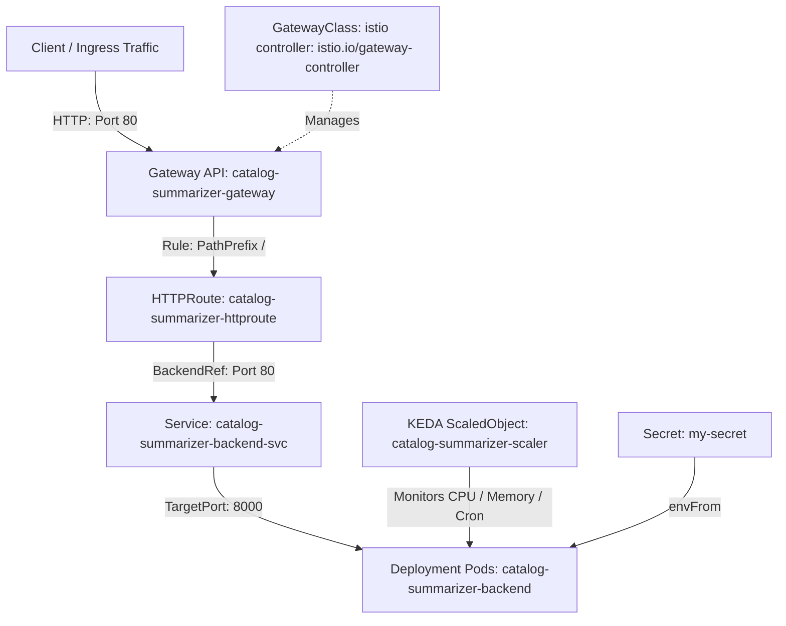

# Comprehensive Kubernetes, KEDA & Gateway API Manifest Guide

This guide provides an exhaustive, block-by-block technical reference for [keda-backend-simple.yaml](file:///home/selva/Documents/Production/Product-Catalog-Summarizer-for-Sellers/minikube/keda-backend-simple.yaml). It includes the **full YAML code for every resource block** accompanied by detailed field-by-field explanations, architectural design decisions, and operational instructions.

---

## 1. High-Level Architecture & Traffic Flow

The following diagram illustrates how external client requests travel through the Kubernetes Gateway API and Istio Service Mesh to the application pods, as well as how KEDA and Secrets interact with the workload.



---

## 2. Block-by-Block Manifest Reference & Detailed Analysis

---

### Block 1: Deployment (`kind: Deployment`)

#### Full Manifest Code
```yaml
apiVersion: apps/v1
kind: Deployment
metadata:
  name: catalog-summarizer-backend
  namespace: default
  labels:
    app: catalog-summarizer-backend
spec:
  selector:
    matchLabels:
      app: catalog-summarizer-backend
  template:
    metadata:
      labels:
        app: catalog-summarizer-backend
    spec:
      containers:
      - name: backend
        image: catalog-summarizer-backend:latest
        imagePullPolicy: IfNotPresent
        ports:
        - containerPort: 8000
          name: http
        envFrom:
        - secretRef:
            name: my-secret
        env:
        - name: TF_MODEL_NAME
          value: "gemini-2.0-flash"
        - name: TF_MODEL_TEMPERATURE
          value: "0.3"
        resources:
          requests:
            cpu: "100m"
            memory: "256Mi"
          limits:
            cpu: "500m"
            memory: "512Mi"
        livenessProbe:
          httpGet:
            path: /api/v1/health
            port: 8000
          initialDelaySeconds: 10
          periodSeconds: 15
        readinessProbe:
          httpGet:
            path: /api/v1/health
            port: 8000
          initialDelaySeconds: 5
          periodSeconds: 10
```

#### Detailed Field Explanation & Design Rationale

| Field | Description & Purpose |
| :--- | :--- |
| `apiVersion: apps/v1` | Standard Kubernetes API group for workload management resources. |
| `kind: Deployment` | Specifies a workload controller that manages Pod instances declaratively. |
| `metadata.name` | `catalog-summarizer-backend` — The unique resource name in the namespace. |
| `metadata.namespace` | `default` — The target namespace for deployment. |
| `spec.selector.matchLabels` | Defines how the Deployment controller finds which Pods to manage. Must match `template.metadata.labels`. |
| **`spec.replicas` (Omitted)** | **Crucial Architecture Decision:** `replicas` is intentionally omitted. When KEDA (`ScaledObject`) or an HPA manages scaling, hardcoding `replicas: 1` would cause `kubectl apply` to reset running pods to 1, overriding active autoscaling decisions and causing pod thrashing. Omitting `replicas` allows KEDA sole ownership of the replica count. |
| `containers[0].name` | `backend` — Name of the container inside the pod. |
| `containers[0].image` | `catalog-summarizer-backend:latest` — Docker image name for the FastAPI app. |
| `containers[0].imagePullPolicy` | `IfNotPresent` — Uses local cached image if available (optimal for Minikube). |
| `containers[0].ports` | Listens on `containerPort: 8000` (FastAPI/Uvicorn default port). Named `http` for Istio Envoy protocol identification. |
| `containers[0].envFrom` | Automatically injects all key-value pairs stored in Kubernetes Secret `my-secret` as environment variables. |
| `containers[0].env` | Explicit non-secret environment variables (`TF_MODEL_NAME: gemini-2.0-flash`, `TF_MODEL_TEMPERATURE: 0.3`). |
| `containers[0].resources` | **Requests:** `100m` CPU / `256Mi` Memory (guaranteed minimum). <br/> **Limits:** `500m` CPU / `512Mi` Memory (maximum allowed before throttling/OOM kill). |
| `containers[0].livenessProbe` | Periodically checks `http://:8000/api/v1/health` every 15s (after 10s delay). Automatically restarts unhealthy containers. |
| `containers[0].readinessProbe` | Checks `http://:8000/api/v1/health` every 10s (after 5s delay). Ensures container is ready to handle traffic before joining Service endpoints. |

---

### Block 2: Service (`kind: Service`)

#### Full Manifest Code
```yaml
apiVersion: v1
kind: Service
metadata:
  name: catalog-summarizer-backend-svc
  namespace: default
spec:
  type: ClusterIP
  ports:
  - port: 80
    targetPort: 8000
    protocol: TCP
    name: http
  selector:
    app: catalog-summarizer-backend
```

#### Detailed Field Explanation & Design Rationale

| Field | Description & Purpose |
| :--- | :--- |
| `apiVersion: v1` | Core Kubernetes API group for fundamental network resources. |
| `kind: Service` | Abstracts access to a set of pods using a stable virtual IP (ClusterIP) and DNS entry. |
| `metadata.name` | `catalog-summarizer-backend-svc` — DNS entry name within the cluster. |
| `spec.type` | `ClusterIP` — Exposes the Service on a cluster-internal IP (standard microservice design). |
| `spec.ports[0].port` | `80` — Standard HTTP port exposed to internal cluster clients (`http://catalog-summarizer-backend-svc`). |
| `spec.ports[0].targetPort` | `8000` — Routes traffic from Service port `80` to container port `8000` where Uvicorn listens. |
| **`spec.ports[0].name`** | **`http` — Critical Istio Requirement:** Istio inspects port names to determine protocol. Naming the port `http` enables Istio Envoy proxies to collect L7 HTTP telemetry, distributed tracing, and routing features. |
| `spec.selector` | Maps Service traffic to all Pods with label `app: catalog-summarizer-backend`. |

---

### Block 3: KEDA ScaledObject (`kind: ScaledObject`)

#### Full Manifest Code
```yaml
apiVersion: keda.sh/v1alpha1
kind: ScaledObject
metadata:
  name: catalog-summarizer-scaler
  namespace: default
spec:
  scaleTargetRef:
    apiVersion: apps/v1
    kind: Deployment
    name: catalog-summarizer-backend
  minReplicaCount: 1
  maxReplicaCount: 3
  pollingInterval: 15
  cooldownPeriod: 60
  triggers:
  - type: cpu
    metricType: Utilization
    metadata:
      value: "70"
  - type: memory
    metricType: Utilization
    metadata:
      value: "75"
  - type: cron
    metadata:
      timezone: Asia/Kolkata
      start: "0 9 * * 1-5"
      end: "0 20 * * 1-5"
      desiredReplicas: "3"
```

#### Detailed Field Explanation & Design Rationale

| Field | Description & Purpose |
| :--- | :--- |
| `apiVersion: keda.sh/v1alpha1` | KEDA Custom Resource Definition (CRD) API group. |
| `kind: ScaledObject` | KEDA custom resource defining autoscaling rules and triggers for a workload. |
| `spec.scaleTargetRef` | Identifies `Deployment/catalog-summarizer-backend` as the target resource to scale. |
| `spec.minReplicaCount` | `1` — Guarantees at least 1 running pod instance at all times. |
| `spec.maxReplicaCount` | `3` — Caps scaling at 3 pod instances under peak load. |
| `spec.pollingInterval` | `15` — Checks trigger metrics every 15 seconds. |
| `spec.cooldownPeriod` | `60` — Waits 60 seconds after metrics drop before initiating scale-down actions. |
| **Trigger 1 (`cpu`)** | Scales up when average CPU utilization across all active pods exceeds `70%`. |
| **Trigger 2 (`memory`)** | Scales up when average Memory utilization across all active pods exceeds `75%`. |
| **Trigger 3 (`cron`)** | Pre-scales the deployment to `3` desired replicas during business hours (`09:00 - 20:00 IST`, Monday–Friday) to prevent cold-start latency during expected peak traffic. |

---

### Block 4: GatewayClass (`kind: GatewayClass`)

#### Full Manifest Code
```yaml
apiVersion: gateway.networking.k8s.io/v1
kind: GatewayClass
metadata:
  name: istio
spec:
  controllerName: istio.io/gateway-controller
```

#### Detailed Field Explanation & Design Rationale

| Field | Description & Purpose |
| :--- | :--- |
| `apiVersion: gateway.networking.k8s.io/v1` | Official Kubernetes Gateway API standard specification. |
| `kind: GatewayClass` | **Cluster-Scoped Resource:** Defines a class of Gateways that can be instantiated in the cluster (analogous to StorageClass for volumes). |
| `metadata.name` | `istio` — The identifier referenced by Gateway resources (`gatewayClassName: istio`). |
| `spec.controllerName` | `istio.io/gateway-controller` — Directs Kubernetes to use Istio's Gateway API controller for provisioning network infrastructure. |

---

### Block 5: Gateway (`kind: Gateway`)

#### Full Manifest Code
```yaml
apiVersion: gateway.networking.k8s.io/v1
kind: Gateway
metadata:
  name: catalog-summarizer-gateway
  namespace: default
spec:
  gatewayClassName: istio
  listeners:
  - name: http
    port: 80
    protocol: HTTP
    allowedRoutes:
      namespaces:
        from: Same
```

#### Detailed Field Explanation & Design Rationale

| Field | Description & Purpose |
| :--- | :--- |
| `apiVersion: gateway.networking.k8s.io/v1` | Kubernetes Gateway API group. |
| `kind: Gateway` | Represents the network entrypoint load balancer receiving external traffic. |
| `metadata.name` | `catalog-summarizer-gateway` — Name of the gateway instance. |
| `spec.gatewayClassName` | `istio` — References the `GatewayClass` defined in Block 4. |
| `listeners[0].name` | `http` — Name of the network listener. |
| `listeners[0].port` | `80` — Binds the listener to external HTTP port 80. |
| `listeners[0].protocol` | `HTTP` — Specifies standard HTTP protocol handling. |
| `listeners[0].allowedRoutes` | Restricts route bindings to `HTTPRoute` resources in the `Same` namespace (`default`). |

---

### Block 6: HTTPRoute (`kind: HTTPRoute`)

#### Full Manifest Code
```yaml
apiVersion: gateway.networking.k8s.io/v1
kind: HTTPRoute
metadata:
  name: catalog-summarizer-httproute
  namespace: default
spec:
  parentRefs:
  - name: catalog-summarizer-gateway
  rules:
  - matches:
    - path:
        type: PathPrefix
        value: /
    backendRefs:
    - name: catalog-summarizer-backend-svc
      port: 80
```

#### Detailed Field Explanation & Design Rationale

| Field | Description & Purpose |
| :--- | :--- |
| `apiVersion: gateway.networking.k8s.io/v1` | Kubernetes Gateway API group. |
| `kind: HTTPRoute` | Specifies Layer-7 HTTP routing rules for requests matching the parent Gateway. |
| `spec.parentRefs` | Binds this routing rule set to `catalog-summarizer-gateway` (Block 5). |
| `spec.rules[0].matches` | Matches all incoming requests with path prefix `/` (entire application path tree). |
| `spec.rules[0].backendRefs` | Directs matched HTTP traffic to `catalog-summarizer-backend-svc` (Block 2) on Service port `80`. |

---

## 3. Operational Guide & Commands

### 1. Create Secret Prerequisites
Before applying the manifest, create `my-secret` containing your environment variables:
```bash
kubectl create secret generic my-secret --from-env-file=.env
```

### 2. Deploy Manifest
Apply the unified single-file manifest:
```bash
kubectl apply -f minikube/keda-backend-simple.yaml
```

### 3. Verification & Monitoring Commands

```bash
# Verify Pod status
kubectl get pods -l app=catalog-summarizer-backend

# Check KEDA Autoscaler Status & Active Replica Count
kubectl get scaledobject catalog-summarizer-scaler

# Check Gateway API Infrastructure Status
kubectl get gatewayclass,gateway,httproute

# Describe HTTPRoute details
kubectl describe httproute catalog-summarizer-httproute
```

---

## 4. Troubleshooting Matrix

| Symptom | Root Cause | Fix / Remedy |
| :--- | :--- | :--- |
| `CreateContainerConfigError` | Secret `my-secret` missing | Execute `kubectl create secret generic my-secret --from-env-file=.env` |
| Pods stuck in `Pending` | Insufficient CPU/Memory allocations | Check node resource pressure via `kubectl describe nodes` |
| `Gateway` status `NotReconciled` | Istio CRDs/controller not installed | Verify Istio Gateway API installation (`istioctl install`) |
| KEDA does not scale pods | Metrics Server or KEDA operator down | Check operator status: `kubectl get pods -n keda` |
