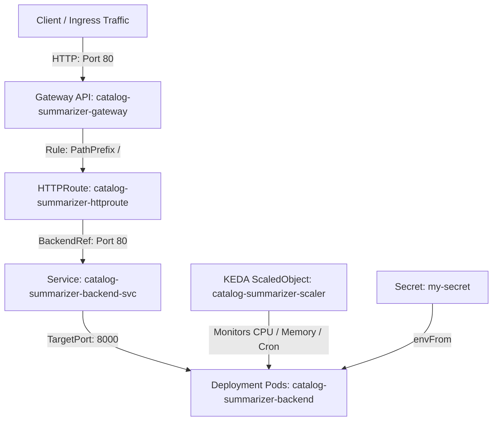

# Kubernetes, KEDA & Gateway API Manifest Guide

This document provides a detailed block-by-block explanation of [keda-backend-simple.yaml](file:///home/selva/Documents/Production/Product-Catalog-Summarizer-for-Sellers/minikube/keda-backend-simple.yaml), covering architecture, design rationale, port mappings, autoscaling logic, and Gateway API routing.

---

## 1. High-Level Architecture Diagram



---

## 2. Block-by-Block Deep Dive

### Block 1: Deployment (`kind: Deployment`)

#### Purpose
Defines the pod template, container specifications, resource allocations, health probes, and environment variables for the FastAPI backend service.

#### Key Specs & Design Rationale
- **Omission of `replicas`**: The `replicas` field is intentionally omitted in `spec`. When KEDA's `ScaledObject` is active, KEDA dynamically adjusts the replica count on the Deployment. Including `replicas: 1` would cause `kubectl apply` to forcefully reset the running pod count to `1`, overwriting active KEDA scaling decisions and causing pod thrashing.
- **Container Port (`8000`)**: The Uvicorn/FastAPI application runs on internal container port `8000`.
- **Environment & Secrets (`envFrom`)**: Mounted dynamically from `my-secret` (created via `kubectl create secret generic my-secret --from-env-file=.env`).
- **Resource Requests & Limits**: Requests `100m` CPU / `256Mi` memory; limited to `500m` CPU / `512Mi` memory.
- **Health Probes**: Liveness (`/api/v1/health` after 10s) and Readiness (`/api/v1/health` after 5s) probes ensure unstable or unready containers are automatically restarted or removed from Service endpoints.

---

### Block 2: Service (`kind: Service`)

#### Purpose
Acts as the internal load balancer exposing the Deployment pods under a stable DNS entry (`catalog-summarizer-backend-svc`).

#### Key Specs & Design Rationale
- **Standard Service Port (`port: 80`)**: Exposes port `80` internally within the cluster, enabling clean microservice URIs (`http://catalog-summarizer-backend-svc`).
- **Target Port (`targetPort: 8000`)**: Forwards incoming port `80` traffic to container port `8000` where Uvicorn listens.
- **Istio Protocol Naming (`name: http`)**: Naming the port `http` signals Istio Envoy sidecars to automatically enable HTTP L7 protocol processing, tracing, and metrics collection.

---

### Block 3: KEDA ScaledObject (`kind: ScaledObject`)

#### Purpose
Provides event-driven and metric-based autoscaling for the backend Deployment.

#### Key Specs & Design Rationale
- **Target Reference**: Directly monitors `Deployment/catalog-summarizer-backend`.
- **Scaling Limits**: `minReplicaCount: 1` (guarantees at least 1 running pod) up to `maxReplicaCount: 3`.
- **Triggers**:
  1. **CPU Utilization Trigger**: Scales up when average CPU utilization across pods exceeds `70%`.
  2. **Memory Utilization Trigger**: Scales up when average Memory utilization exceeds `75%`.
  3. **Cron Trigger**: Pre-scales deployment to `3` desired replicas during business peak hours (`09:00 - 20:00 IST`, Monday–Friday) to eliminate cold-start latency.

---

### Block 4: GatewayClass (`kind: GatewayClass`)

#### Purpose
Defines the controller template class for managing Gateway instances in accordance with the Kubernetes Gateway API standard.

#### Key Specs & Design Rationale
- **Controller Binding**: Binds `gatewayClassName: istio` to Istio's Gateway API controller (`istio.io/gateway-controller`).

---

### Block 5: Gateway (`kind: Gateway`)

#### Purpose
Acts as the external network entrypoint receiving HTTP traffic at the edge of the cluster.

#### Key Specs & Design Rationale
- **Class Reference**: Uses `gatewayClassName: istio`.
- **Listener Configuration**: Listens on port `80` for HTTP protocol connections and accepts routes from the `Same` namespace.

---

### Block 6: HTTPRoute (`kind: HTTPRoute`)

#### Purpose
Configures Layer-7 HTTP routing rules matching incoming URLs and directing them to backend Services.

#### Key Specs & Design Rationale
- **Parent Reference**: Binds to `catalog-summarizer-gateway`.
- **Path Matching**: Matches all requests starting with path prefix `/`.
- **Backend Reference**: Routes matched traffic to `catalog-summarizer-backend-svc` on port `80`.

---

## 3. Deployment Instructions

### Step 1: Create the Secret
Create `my-secret` from your local `.env` file prior to applying the manifest:
```bash
kubectl create secret generic my-secret --from-env-file=.env
```

### Step 2: Apply the Manifest
Apply the complete manifest containing all 6 resources:
```bash
kubectl apply -f minikube/keda-backend-simple.yaml
```

### Step 3: Verify Deployment & Scaling Status
```bash
# Check Pods
kubectl get pods -l app=catalog-summarizer-backend

# Check KEDA ScaledObject Status
kubectl get scaledobject catalog-summarizer-scaler

# Check Gateway API Resources
kubectl get gatewayclass,gateway,httproute
```

---

## 4. Verification & Troubleshooting

| Issue | Root Cause | Resolution |
| :--- | :--- | :--- |
| `CreateContainerConfigError` | `my-secret` does not exist | Run `kubectl create secret generic my-secret --from-env-file=.env` |
| Pods stuck in `Pending` | Insufficient CPU/Memory | Verify cluster node capacity (`kubectl top nodes`) |
| Gateway `NotReconciled` | Istio CRDs / Controller missing | Ensure Istio Gateway API controller is installed (`istioctl install`) |
